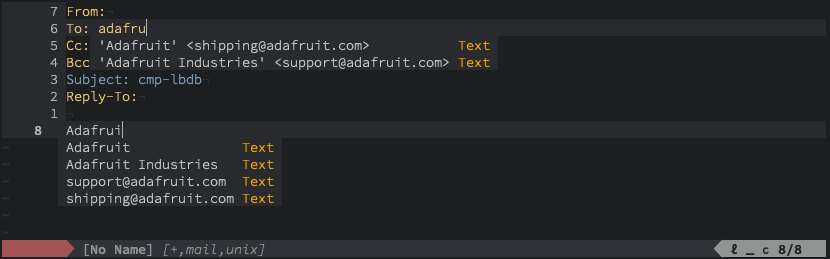

cmp-lbdb
========

lbdb completion source for [nvim-cmp](https://github.com/hrsh7th/nvim-cmp). Names, emails, and email header recipient formatted completions are provided for contacts found in lbdb.



Installation
------------

Use your favorite plugin manager:

- [vim-plug](https://github.com/junegunn/vim-plug)
  ```vim
  Plug 'codybuell/cmp-lbdb'
  ```
- [pathogen](https://github.com/tpope/vim-pathogen)
  ```bash
  git clone https://github.com/codybuell/cmp-lbdb.git ~/.config/nvim/bundle/cmp-lbdb
  ```
- native package manager
  ```bash
  git clone https://github.com/codybuell/cmp-lbdb.git ~/.config/nvim/pack/bundle/opt/cmp-lbdb
  ```
  ```vim
  packadd! cmp-lbdb
  ```

Usage
-----
```lua
-- setup with defaults (markdown and mail file types)
require('cmp').setup({
  -- snip...
  sources = {
    -- snip...
    { name = lbdb },
    -- snip...
  }
})

-- or alternatively, enable with overrides
require('cmp').setup({
  -- snip...
  sources = {
    -- snip...
    {
      name = 'lbdb',
      filetypes = { 'mail', 'markdown', 'gitcommit' }
      blacklist = {
        'user@host.com',
        '.*noreply.*',
      },
    },
    -- snip...
  }
})
```
